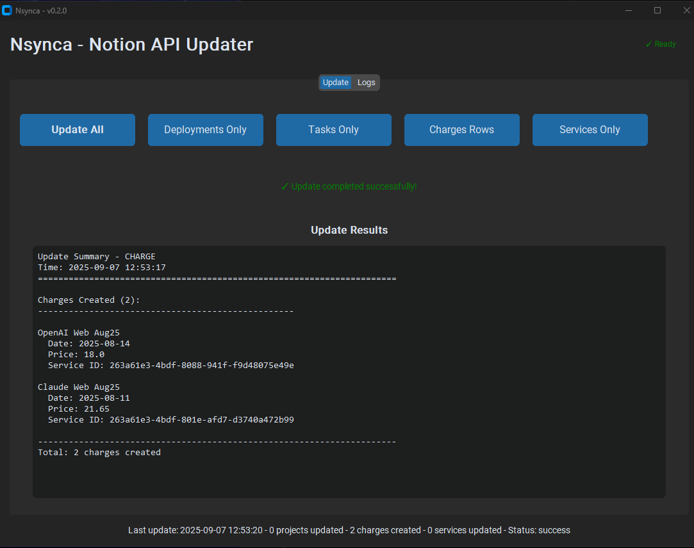
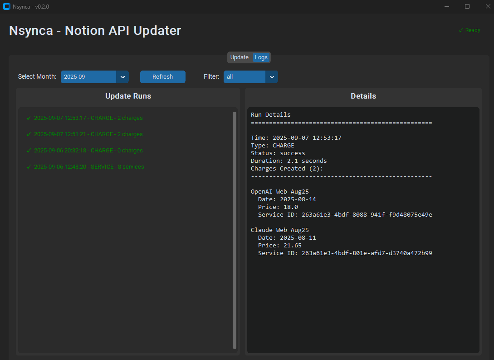

# 🛠️ Nsynca

A lightweight Python toolkit for syncing, updating, and analyzing Notion workspace data via the official Notion API.





## 🔗 Prerequisites

**Notion Setup:**
- Create an [integration in Notion](https://www.notion.so/profile/integrations)
- Share database access: Open database → ••• → Connections → Add your integration

**Development Tools:**
- Python 3.11.x (not 3.12+)
- [uv package manager](https://docs.astral.sh/uv/getting-started/installation/)
- Make: `winget install GnuWin32.Make` (Windows) | `brew install make` (macOS) | `sudo apt install make` (Linux)


## 🛡️ Code Quality and Security
- **Gitleaks** for secrets scanning
- **Commitizen** for conventional commit messages  
- **Ruff** for linting and formatting


## 🔧 Setup

1. **Clone the repo**
```bash
git clone https://github.com/lisekarimi/nsynca.git
cd nsynca
```

2. **Configure `.env`**

Rename `.env.example` to `.env` and populate it with the required secrets.


3. Install pre-commit hooks (optional)
```bash
make install-hooks
```


## 🖥️ Running the App

The virtual environment is created seamlessly when running the following commands - the magic of uv! ✨

**For development:**
```bash
make run       # Run the main app
make gui       # Run the GUI (for testing and dev)
```

**Build executable:**
```bash
make build-exe    # Generate spec file
make compile-exe  # Create executable
```

**For daily use:**
- Run the `.exe` file in `dist/` folder
- Provides GUI interface
- Choose to update all fields or specific ones (Deploy, Task)

📌 All other commands are listed in the `Makefile`.


## 📑 Logs

**Log locations:**
- Development: `logs/` in project root
- Executable: `dist/logs/` next to the `.exe` file

**View logs:**
- Open the GUI to browse logs from previous runs
- Filter by month, update type, or status (success, failed)


## 🔐 Publishing Docker Image to GitHub Packages

Since this is a private project, the Docker image is hosted in GitHub Packages.

**Prerequisites:**
1. **Generate GitHub PAT**: GitHub → Settings → Developer settings → Personal access tokens → Tokens (classic)
   - Name: "Docker Package Registry" 
   - Expiration: 1 year
   - Scopes: `write:packages`, `read:packages`
   - Copy the token immediately

2. **Add to .env**: Store as `GITHUB_TOKEN`

3. **Build & publish**: Use Makefile commands to build, tag, and push the image

📌 All Docker commands are available in the `Makefile`.